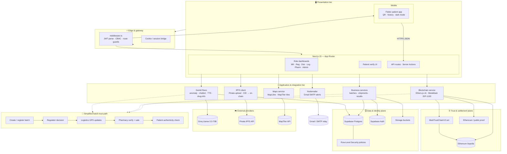

<div align="center">


# 🏥 MediTrustChain

### *Blockchain-Powered Pharmaceutical Supply Chain*

[](https://nextjs.org/)
[](https://soliditylang.org/)
[](https://supabase.com/)
[](https://www.typescriptlang.org/)
[](https://flutter.dev/)
[](LICENSE)

**A final year B.E. Computer Science project** — a full-stack decentralised pharmaceutical supply chain platform that uses blockchain immutability, AI-powered anomaly detection, and real-time GPS tracking to eradicate counterfeit medicines.

[🚀 Live Demo](#-quick-start) · [📱 Mobile App](FLUTTER-APP/) · [📄 Project Report](MediTrustChain_Project_Report.html) · [🔗 Smart Contract](https://sepolia.etherscan.io/address/0x1E60556dE1625bD468eCe9e45a421aFa4bb1F73D)

</div>

---

## 📌 Table of Contents

- [✨ Features](#-features)
- [📸 Product gallery](#-product-gallery)
- [🏗️ System Architecture](#️-system-architecture)
- [🔄 Supply Chain Flow](#-supply-chain-flow)
- [🛠️ Tech Stack](#️-tech-stack)
- [👥 Roles & Dashboards](#-roles--dashboards)
- [🚀 Quick Start](#-quick-start)
- [🌐 Environment Variables](#-environment-variables)
- [📱 Mobile App](#-mobile-app)
- [⛓️ Blockchain](#️-blockchain)
- [🤖 AI Features](#-ai-features)
- [📁 Project Structure](#-project-structure)
- [🧪 Testing Guide](#-testing-guide)

---

## ✨ Features

<table>
<tr>
<td width="50%">

### 🔗 Blockchain Integrity
- Immutable batch registry on **Ethereum Sepolia**
- Every status change hashed on-chain
- Smart contract: `MediTrustChainV2.sol`
- Verify transactions on Etherscan

</td>
<td width="50%">

### 🤖 AI Anomaly Detection
- **Groq Llama-3.3-70B** powered analysis
- Detects time delays, status regressions
- Flags expiry & quantity anomalies
- Role-aware AI chatbot assistant

</td>
</tr>
<tr>
<td width="50%">

### 🗺️ Real-Time GPS Tracking
- MapLibre GL / MapTiler integration
- Live shipment map with route history
- Demo mode for presentations
- Batch location at every supply stop

</td>
<td width="50%">

### 🛡️ Claims-Based Access Control
- JWT-based CBAC middleware (Edge Runtime)
- 6 distinct stakeholder roles
- Row-Level Security on Supabase
- Complete audit trail for every action

</td>
</tr>
<tr>
<td width="50%">

### 📧 Email Notifications
- SMTP alerts for batch approvals/recalls
- Regulator notified on anomalies
- Configurable via Gmail App Password

</td>
<td width="50%">

### 📦 IPFS Document Storage
- Compliance documents via Pinata
- Content-addressed, tamper-proof
- Hash stored immutably on-chain

</td>
</tr>
</table>

---

## 📸 Product gallery

<p align="center">
  <sub>High-resolution UI captures, on-chain proofs, AI dashboards, and architecture diagrams — all assets live under <code>https://github.com/PRAJWAL-BR-0304/MediTrustChain/releases/download/readme-screenshots/</code>.</sub>
</p>

> **Why release URLs:** Plain `raw.githubusercontent.com` links can return **404** for some clients (and briefly right after pushes) even when the file exists. Hosting screenshots as **release assets**—the same approach as [KNOWLEDGE-BASE](https://github.com/PRAJWAL-BR-0304/KNOWLEDGE-BASE)—uses `github.com/.../releases/download/...` URLs that GitHub’s README image proxy resolves reliably.

### 🌐 Landing & authentication

<table>
<tr>
<td width="50%" align="center"><b>Landing — homepage</b><br/><br/></td>
<td width="50%" align="center"><b>Stakeholder login</b><br/><br/></td>
</tr>
<tr>
<td align="center"><b>Admin authentication</b><br/><br/></td>
<td align="center"></td>
</tr>
</table>

### 👑 Admin & governance

<table>
<tr>
<td width="50%" align="center"><b>Admin dashboard</b><br/><br/></td>
<td width="50%" align="center"><b>Admin analytics</b><br/><br/></td>
</tr>
<tr>
<td align="center"><b>CBAC permission assignment</b><br/><br/></td>
<td align="center"><b>System audit logs</b><br/><br/></td>
</tr>
</table>

### 🏛️ Regulator & supply roles

<table>
<tr>
<td width="50%" align="center"><b>Drug template approval</b><br/><br/></td>
<td width="50%" align="center"><b>Regulator audit report</b><br/><br/></td>
</tr>
<tr>
<td align="center"><b>Distributor dashboard</b><br/><br/></td>
<td align="center"><b>Pharmacy dashboard</b><br/><br/></td>
</tr>
<tr>
<td align="center"><b>Manufacturer QR generation</b><br/><br/></td>
<td align="center"><b>Batch details & live tracking</b><br/><br/></td>
</tr>
</table>

### 💊 Patient verification

<table>
<tr>
<td width="50%" align="center"><b>Patient verification portal</b><br/><br/></td>
<td width="50%" align="center"><b>Technical verification details</b><br/><br/></td>
</tr>
</table>

### ⛓️ Blockchain & wallet

<table>
<tr>
<td width="50%" align="center"><b>Etherscan transaction</b><br/><br/></td>
<td width="50%" align="center"><b>Public verification proof</b><br/><br/></td>
</tr>
<tr>
<td align="center"><b>Demo transaction flow</b><br/><br/></td>
<td align="center"><b>MetaMask integration</b><br/><br/></td>
</tr>
</table>

### 🤖 AI & assistance

<table>
<tr>
<td width="50%" align="center"><b>AI anomaly dashboard</b><br/><br/></td>
<td width="50%" align="center"><b>Anomaly detection pipeline</b><br/><br/></td>
</tr>
<tr>
<td align="center"><b>AI chatbot assistant</b><br/><br/></td>
<td align="center"><b>AI-powered help</b><br/><br/></td>
</tr>
</table>

### 📐 Diagrams & deep architecture (static)

<table>
<tr>
<td width="50%" align="center"><b>End-to-end working flow</b><br/><br/></td>
<td width="50%" align="center"><b>Architecture illustration</b><br/><br/></td>
</tr>
<tr>
<td align="center"><b>Technology stack overview</b><br/><br/></td>
<td align="center"><b>Hash verification algorithm</b><br/><br/></td>
</tr>
<tr>
<td align="center"><b>Security architecture layers</b><br/><br/></td>
<td align="center"></td>
</tr>
</table>

### 📊 Performance & benchmarks

<table>
<tr>
<td width="50%" align="center"><b>Supply chain performance metrics</b><br/><br/></td>
<td width="50%" align="center"><b>Comparative radar</b><br/><br/></td>
</tr>
<tr>
<td align="center"><b>Performance benchmarks</b><br/><br/></td>
<td align="center"><b>Anomaly detection performance</b><br/><br/></td>
</tr>
<tr>
<td align="center"><b>System throughput analysis</b><br/><br/></td>
<td align="center"><b>Future enhancement roadmap</b><br/><br/></td>
</tr>
</table>

---

## 🏗️ System Architecture

MediTrustChain is a **multi-tier, multi-client** system: browsers and mobile apps hit **Next.js** (App Router + Edge middleware), which orchestrates **Supabase** (Postgres + Auth + RLS), **Genkit/Groq** AI flows, **Ethers.js** against **Sepolia**, **Pinata/IPFS**, **MapTiler/MapLibre**, and **SMTP** notifications. The diagram below models **data planes**, **trust boundaries**, and **typical batch lifecycle** interactions in one view.



<details>
<summary><b>📎 Layer cheat-sheet</b> (click to expand)</summary>

| Plane | Responsibility | Key tech |
|:-----:|----------------|----------|
| **Presentation** | Role UX, patient flows, static assets | Next.js 15, Flutter, Tailwind, Radix |
| **Edge** | Zero-trust entry: token, role claims, redirect | Edge Runtime `middleware.ts` |
| **Application** | Orchestration, side-effects, AI & chain I/O | Route handlers, Genkit, Ethers.js |
| **Data** | Authoritative off-chain state + audit | Supabase + RLS |
| **Chain** | Tamper-evident anchors, verification | Solidity, Sepolia, MetaMask |
| **External** | LLM, maps, IPFS pinning | Groq, MapTiler, Pinata |

</details>

<p align="center">
  <sub>Static architecture slides from the gallery: <code>24–28</code> · On-chain evidence: <code>16–19</code> · AI surface: <code>20–23</code></sub>
</p>

---

## 🔄 Supply Chain Flow

```
 MANUFACTURER          REGULATOR          LOGISTICS          PHARMACY          PATIENT
      │                    │                   │                 │                │
      │  1. Create Batch   │                   │                 │                │
      │──────────────────► │                   │                 │                │
      │                    │  2. Review Batch  │                 │                │
      │                    │ ──────────────────│                 │                │
      │                    │  3. Approve/Reject│                 │                │
      │                    │ ──────────────────│                 │                │
      │                    │                   │ 4. Move Batch   │                │
      │                    │                   │ ──────────────► │                │
      │                    │                   │  (GPS tracked)  │                │
      │                    │                   │                 │ 5. Verify Auth │
      │                    │                   │                 │ ─────────────► │
      │                    │                   │                 │ 6. Dispense    │
      │                    │                   │                 │ ─────────────► │
      │                    │                   │                 │                │
   [PENDING]           [APPROVED/           [IN-TRANSIT/      [AT-PHARMACY/    [SOLD]
                        REJECTED]            DELIVERED]         SOLD]
```

**Blockchain State Machine:** `CREATED → PENDING → APPROVED → IN_TRANSIT → DELIVERED → SOLD`  
Terminal states: `REJECTED | EXPIRED | RECALLED`

---

## 🛠️ Tech Stack

| Layer | Technology | Purpose |
|-------|-----------|---------|
| **Frontend** | Next.js 15.5 + Turbopack | Web application, SSR, Edge Runtime |
| **UI** | Tailwind CSS + Radix UI | Component library & styling |
| **Language** | TypeScript 5.0 | Type-safe full-stack development |
| **Database** | Supabase (PostgreSQL) | Primary data store with RLS |
| **Auth** | Supabase Auth + JWT | Session management & CBAC |
| **Blockchain** | Solidity 0.8.24 + Hardhat | Smart contract deployment |
| **Blockchain Client** | Ethers.js v6 | On-chain reads/writes |
| **Wallet** | MetaMask (EIP-1193) | Web3 transaction signing |
| **AI / LLM** | Genkit + Groq Llama-3.3-70B | Anomaly detection & chatbot |
| **Maps** | MapLibre GL + MapTiler | GPS tracking visualisation |
| **IPFS** | Pinata | Decentralised file storage |
| **Email** | Nodemailer + Gmail SMTP | Notification system |
| **Mobile** | Flutter 3.22 | Patient Android/iOS app |
| **Error Tracking** | Sentry | Production monitoring |
| **Networks** | Ethereum Sepolia + Polygon Amoy | Testnet deployment |

---

## 👥 Roles & Dashboards

| Role | Dashboard URL | Responsibilities |
|------|--------------|-----------------|
| 🏭 **Manufacturer** | `/dashboard/manufacturer` | Create batches, register on blockchain |
| 🏛️ **Regulator** | `/dashboard/regulator` | Approve/reject batches, manage drug templates, issue recalls |
| 🚛 **Distributor** | `/dashboard/distributor` | Accept approved batches for distribution |
| 🚚 **Logistics** | `/dashboard/logistics` | Track shipments, update GPS location |
| 💊 **Pharmacy** | `/dashboard/pharmacy` | Verify authenticity, record sales |
| ⚙️ **Admin** | `/dashboard/admin` | Manage stakeholders, view audit logs |

---

## 🚀 Quick Start

### Prerequisites

- **Node.js** 20+ and npm
- **MetaMask** browser extension (for blockchain features)
- **Supabase** account ([supabase.com](https://supabase.com))
- **Groq** API key ([console.groq.com](https://console.groq.com))

### Installation

```bash
# 1. Clone the repository
git clone https://github.com/PRAJWAL-BR-0304/MediTrustChain.git
cd MediTrustChain

# 2. Install dependencies
npm install

# 3. Set up environment variables
cp .env.example .env.local
# Edit .env.local with your actual keys (see below)

# 4. Run database migrations
npx supabase db push

# 5. Start development server
npm run dev
# App runs at http://localhost:9002
```

---

## 🌐 Environment Variables

Copy `.env.example` to `.env.local` and fill in your values:

```env
# AI
GROQ_API_KEY=your_groq_api_key

# Supabase
NEXT_PUBLIC_SUPABASE_URL=https://your-project.supabase.co
NEXT_PUBLIC_SUPABASE_ANON_KEY=your_anon_key
SUPABASE_SERVICE_ROLE_KEY=your_service_role_key

# Blockchain
NEXT_PUBLIC_CONTRACT_ADDRESS=0x...your_deployed_contract
NEXT_PUBLIC_DEFAULT_CHAIN=sepolia

# Maps
NEXT_PUBLIC_MAPTILER_API_KEY=your_maptiler_key

# IPFS
NEXT_PUBLIC_PINATA_API_KEY=your_pinata_key
PINATA_SECRET_KEY=your_pinata_secret

# Email (Gmail App Password)
SMTP_USER=your@gmail.com
SMTP_PASSWORD=xxxx xxxx xxxx xxxx
```

> ⚠️ **Never commit `.env.local`** — it is gitignored. Use `.env.example` as the template.

---

## ⛓️ Blockchain

### Smart Contract Deployment

```bash
cd blockchain
npm install

# Compile
npx hardhat compile

# Deploy to Sepolia
npx hardhat run scripts/deploy.ts --network sepolia

# Verify on Etherscan
npx hardhat run scripts/verify-batch.ts --network sepolia
```

### Deployed Contract

| Network | Address |
|---------|---------|
| **Ethereum Sepolia** | [`0x1E60556dE1625bD468eCe9e45a421aFa4bb1F73D`](https://sepolia.etherscan.io/address/0x1E60556dE1625bD468eCe9e45a421aFa4bb1F73D) |

---

## 🤖 AI Features

Powered by **Groq's Llama-3.3-70B** via Firebase Genkit:

| Flow | Description |
|------|-------------|
| `anomaly-detection-flow` | Analyses batches for delays, regressions, expiry & quantity anomalies |
| `chatbot-flow` | Role-aware conversational assistant |
| `drug-info-flow` | Drug composition, dosage & storage information |
| `analytics-flow` | Supply chain performance summaries |
| `patient-drug-authenticity-check` | Patient-facing authenticity report |
| `text-to-speech-flow` | Accessibility audio output |

---

## 📱 Mobile App

The Flutter patient app lives in [`FLUTTER-APP/`](FLUTTER-APP/):

```bash
cd FLUTTER-APP
flutter pub get
flutter run           # Debug
flutter build apk     # Release APK
```

**Features:** QR/manual batch verification · Blockchain proof · Scan history · Dark theme

---

## 📁 Project Structure

```
MediTrustChain/
├── src/
│   ├── app/                    # Next.js App Router pages
│   │   ├── dashboard/          # Role-based dashboards (6 roles)
│   │   ├── api/                # Server-side API routes
│   │   └── ...                 # Auth pages (login, signup, verify)
│   ├── components/             # Reusable UI components
│   ├── contexts/               # React contexts (auth, batches, notifications)
│   ├── lib/                    # Core libraries
│   │   ├── blockchain/         # Ethers.js integration
│   │   ├── supabase/           # DB queries & helpers
│   │   ├── ai/                 # Genkit AI flows
│   │   ├── ipfs/               # Pinata IPFS client
│   │   └── email/              # SMTP notifications
│   └── middleware.ts           # Edge Runtime CBAC guard
├── blockchain/
│   ├── contracts/
│   │   └── MediTrustChainV2.sol  # Main smart contract
│   └── scripts/                   # Deploy & verify scripts
├── FLUTTER-APP/                # Patient mobile app (Flutter)
├── supabase/
│   ├── migrations/             # 20 progressive DB migrations
│   └── seed.sql                # Initial seed data
└── .env.example                # Environment variable template
```

---

## 🧪 Testing Guide

### Demo GPS Coordinates

| Stop | Location | Latitude | Longitude |
|------|----------|----------|-----------|
| 1️⃣ | Cipla Factory, Patalganga | `18.8648` | `73.1575` |
| 2️⃣ | Nagpur DC Warehouse | `21.1458` | `79.0882` |
| 3️⃣ | Apollo Pharmacy, Hyderabad | `17.3850` | `78.4867` |

### Sample Batch Data

| Field | Value |
|-------|-------|
| Drug | Imatinib Mesylate 400mg |
| Qty | 50 units |
| MFG Date | 2026-05-13 |
| EXP Date | 2026-09-30 |
| Strength | 400mg |

> Use **Presentation Demo Mode** toggle in Logistics & Pharmacy dashboards to enter GPS manually when live location is unavailable.

---

## 👨‍💻 Authors

**Prajwal B R** — B.E. Computer Science & Engineering  
Batch of 2022–2026

---

## 📄 License

This project is licensed under the [MIT License](LICENSE).

---

<div align="center">

**Built with ❤️ for final year project evaluation**

⭐ Star this repo if you find it useful!

</div>
